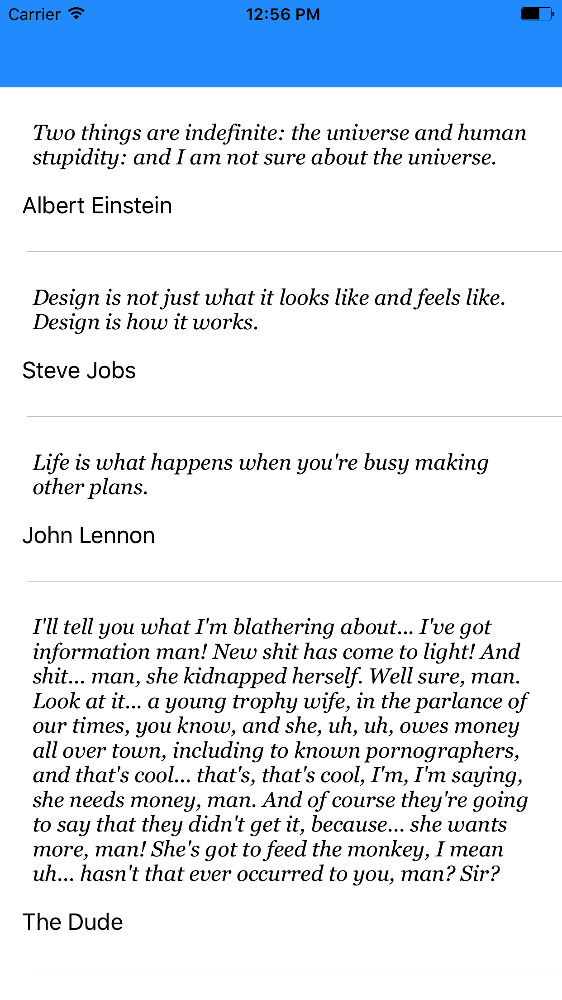

[Correct way to implement table view controllers](http://matteomanferdini.com/the-correct-way-to-display-lists-in-ios-and-what-many-developers-do-wrong/) by Matteo Manferdini.

Having difficulty with this a few days ago, I decided to step back and work on this sample project. The tutorial (link above) was placed into my LinkedIn feed right on time 💡

Try this out & enjoy!

Thank you Matteo

